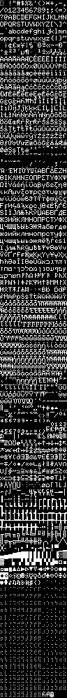

# embedded-graphics-unicodefonts

Rust crate for `embedded-graphics` fonts with larger range of unicode characters such as drawing glyphs or braille.
Created for [Mousefood](https://github.com/j-g00da/mousefood).

**Work in progress** - for now, only `BASIC_6X10` font is available,
which is an equivalent of `embedded_graphics::mono_font::ascii::FONT_6X10`.

Generated using [embedded-graphics/bdf](https://github.com/embedded-graphics/bdf).
